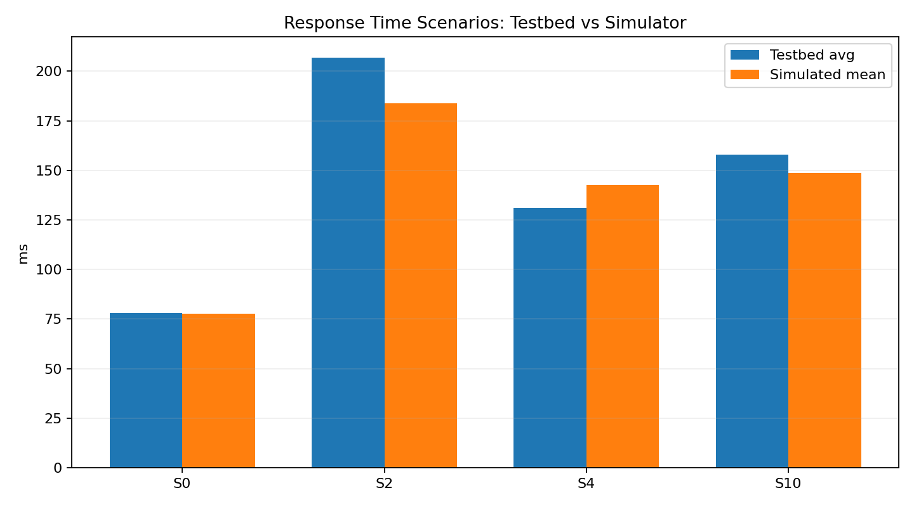

# Response Time Scenario Comparison

Simulator config: `examples/bookinfo-3c-xr.conf`

Allocation file: `final_allocation_kubetwin_2_objectives_16072026.json`

La differenza principale sembra essere dovuta ai tempi di servizio. Il simulatore, tramite un semplice algoritmo, stima l'RPS a livello del container.
Il valore di RPS viene poi utilizzato per campionare i tempi di servizio dalla MDN. Aumentando questo valore di RPS con un `rps_correction_factor` si ottengono dei risultati molto più vicini al testbed. Un'altra soluzione è quella di impostare l'RPS a un valore statico (30 in questi esperimenti). La configurazione statica produce tempi molto elevati.

| Scenario | Solution | Old Expected (ms) | Testbed Avg (ms) | Testbed P90 (ms) | Testbed P95 (ms) | Simulated Mean (ms) | Delta (ms) | Delta (%) | Spreading |
| --- | ---: | ---: | ---: | ---: | ---: | ---: | ---: | ---: | ---: |
| OPTIMUUM 20 - Soluzione 0 del 16/07/2025 | 0 | 43.0 | 78.0 | 110.0 | 130.0 | 77.62 | -0.38 | -0.49 | 0.92 |
| OPTIMUUM 22 - Soluzione 2 del 16/07/2025 | 2 | 98.0 | 207.0 | 320.0 | 360.0 | 183.84 | -23.16 | -11.19 | 0.17 |
| OPTIMUUM 24 - Soluzione 4 del 16/07/2025 | 4 | 62.0 | 131.0 | 240.0 | 260.0 | 142.61 | 11.61 | 8.86 | 0.54 |
| OPTIMUUM 2_10 - Soluzione 10 del 16/07/2025 | 10 | 72.0 | 158.0 | 260.0 | 260.0 | 148.52 | -9.48 | -6.0 | 0.36 |

## Notes

- `Old Expected` Il valore di ttr calcolato in precedenza dal simulatore.
- `Simulated Mean` Il nuovo TTR calcolato dal simulatore.
- `Delta = simulated_mean - testbed_avg`.
